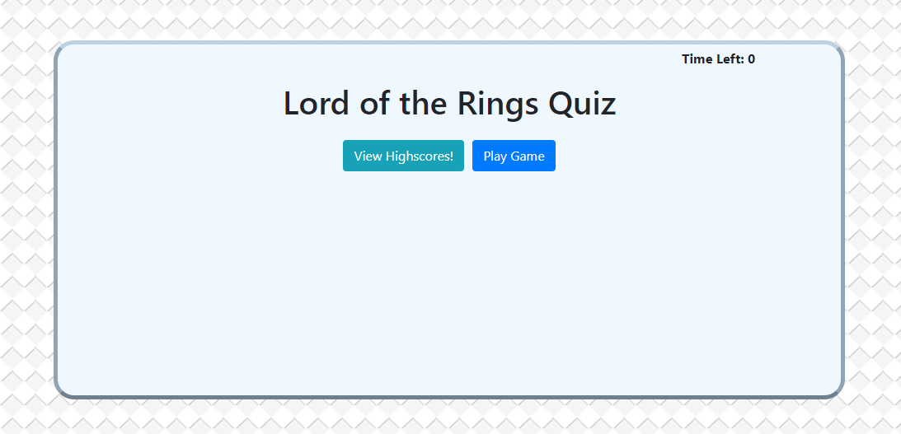

# [Matthews LOTR Quiz Game](https://github.com/TheMatthewSawyer/quizGame)
### https://github.com/TheMatthewSawyer/quizGame
A fun little quiz game with Lord of the Rings questions and a local high-score list.

## Getting Started

This project should run in any modern browser. Internet explorer will break the javascript. Feel free to clone or copy any part of this project.

This project can be edited in any text editor or, preferably, something like Microsoft Visual Studio Code.

## Testing

Testing can be done through an internet browser or chrome with the inspect tool (if you wish to change code on the fly).

## Built with

1. Microsoft Visual Studio Code
    1. https://code.visualstudio.com/
2. Bootstrap
    1. https://getbootstrap.com/
3. jQuery
    1. https://jquery.com/
4. GitHub (Where you are now :grin:)
    1. https://github.com/